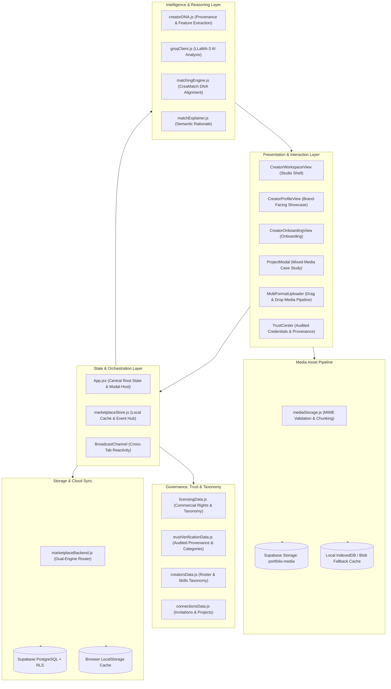
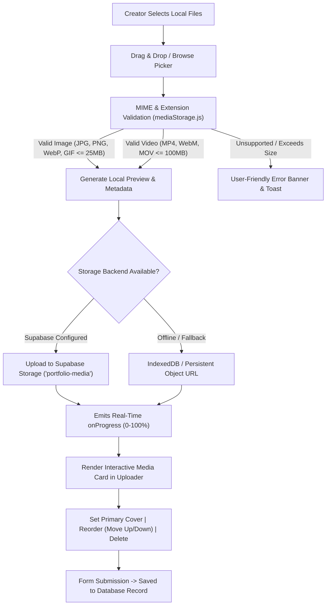
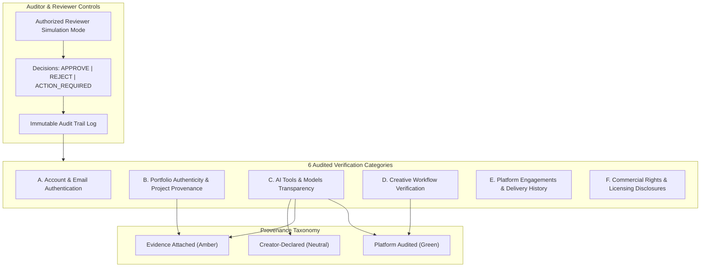
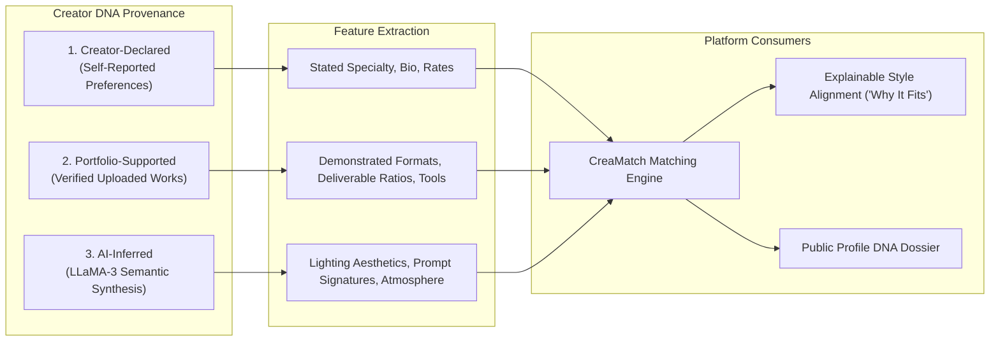
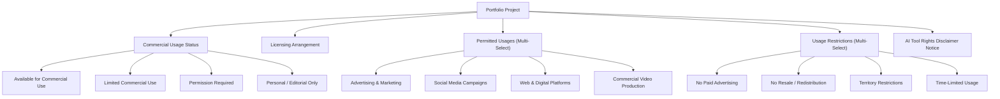
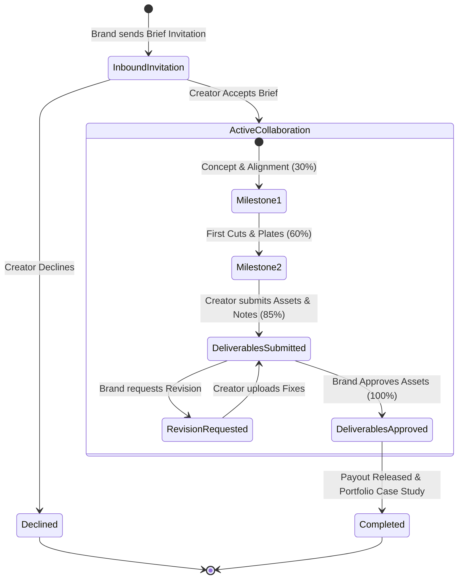
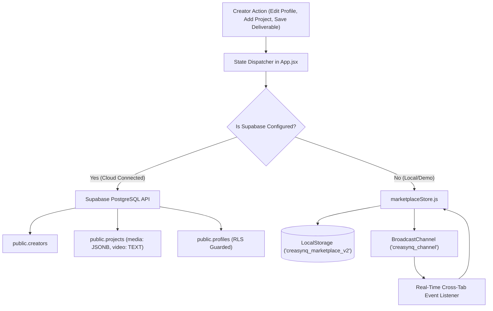

# CreaSynq — Creator-Side Technical Architecture

This document provides a comprehensive technical breakdown of the **Creator Side** of the CreaSynq platform. It details the component architecture, state management and reactive data flows, the Creator DNA intelligence layer, multi-format media pipelines, the Trust & Credibility Center, commercial-use and licensing governance, project workflow tracking, and dual-engine persistence.

---

## 1. High-Level Architecture Overview

The Creator side is designed as an **editorial, portfolio-first creative workspace** for generative AI directors, animators, worldbuilders, and creative technologists. It bridges creator craft with brand discovery through explainable AI style matching, verified production provenance, and transparent commercial licensing.



---

## 2. Component Hierarchy & Navigation Shell

The Creator workspace is organized into a clean, responsive shell with a compact top bar, workspace navigation tabs, and an independent scrollable workspace area.

```mermaid
graph TD
    CWV["CreatorWorkspaceView"]
    
    subgraph Shell_Layout [Workspace Layout Shell]
        Header["Compact Top Bar & Identity Strip"]
        NavBar["Studio Primary Navigation Tabs"]
        Main["Tab Content Rendering Area"]
        Modals["Modal Overlays & Drawers"]
    end

    subgraph Tab_Views [Primary Workspace Tabs]
        T_Over["1. Overview (Studio Metrics & Quick Profile Edit)"]
        T_Port["2. My AI Portfolio (3-Col Gallery & Uploader)"]
        T_Opp["3. Opportunities (Curated Campaign Feed)"]
        T_Inv["4. Invitations (Inbound Brand Briefs)"]
        T_Proj["5. Projects (Active Collaboration Milestones)"]
        T_Msg["6. Messages (Real-Time Client Threads)"]
        T_Trust["7. Trust Center (Verification & Evidence Dossier)"]
    end

    subgraph Modals_Group [Integrated Modals]
        M_Proj["Add / Edit Project Modal (with MultiFormatUploader)"]
        M_Prof["Edit Creator Profile Modal (Name, Role, Bio, Availability)"]
        M_Apply["Apply to Opportunity Modal"]
        M_Sub["Submit Collaboration Deliverables Modal"]
        M_Case["ProjectModal (Full Case Study View)"]
    end

    CWV --> Header
    CWV --> NavBar
    CWV --> Main
    CWV --> Modals

    NavBar --> T_Over
    NavBar --> T_Port
    NavBar --> T_Opp
    NavBar --> T_Inv
    NavBar --> T_Proj
    NavBar --> T_Msg
    NavBar --> T_Trust

    Modals --> M_Proj
    Modals --> M_Prof
    Modals --> M_Apply
    Modals --> M_Sub
    Modals --> M_Case
```



### Key Components

| Component | Path | Responsibility |
| :--- | :--- | :--- |
| **`CreatorWorkspaceView`** | `src/views/CreatorWorkspaceView.jsx` | Primary creator studio dashboard containing studio overview, quick profile edit modal, portfolio management, opportunity feed, collaboration tracking, real-time messaging, and trust center integration. |
| **`MultiFormatUploader`** | `src/components/MultiFormatUploader.jsx` | Reusable drag-and-drop uploader supporting multi-file selection, images (JPG, PNG, WebP, GIF), videos (MP4, WebM, MOV), playable thumbnail cards, reordering, and primary cover selection. |
| **`ProjectModal`** | `src/components/ProjectModal.jsx` | High-fidelity mixed-media case study modal with native video player (`<video controls playsInline>`), multi-asset thumbnail strip, production pipeline steps, and statutory licensing notices. Unconditionally structured hooks prevent rendering race conditions. |
| **`TrustCenter`** | `src/components/TrustCenter.jsx` | Dedicated credibility center with 6 audited verification categories (A–F), evidence attachment for project provenance, AI tool disclosures, and authorized reviewer mode simulation. |
| **`CreatorProfileView`** | `src/views/CreatorProfileView.jsx` | Brand-facing public portfolio displaying hero art, verified DNA dossier, client history, mixed-media indicators, and read-only case study views. |
| **`CreatorOnboardingView`** | `src/views/CreatorOnboardingView.jsx` | Guided creator onboarding flow capturing creative identity, tool preferences, initial portfolio samples, and initial Creator DNA synthesis. |

---

## 3. Data Model Architecture

The creator side utilizes strongly typed schemas synchronized across the frontend, local storage, and PostgreSQL:

### A. Creator Profile Entity
```typescript
interface CreatorProfile {
  id: string;                      // e.g. 'maya-chen'
  name: string;                    // Creator's full professional name
  creativeIdentity: string;        // e.g. 'Cinematic AI Director & Visual Worldbuilder'
  bio: string;                     // Narrative editorial bio
  location: string;                // e.g. 'London / New York'
  avatar: string;                  // Cloud image URL or persistent asset
  coverImage?: string;             // Hero banner visual
  heroWork?: string;               // Flagship portfolio piece
  specialty: string;               // Primary discipline (e.g. 'AI Cinematography')
  technicalSkills: string[];       // Tools & models (Midjourney, Runway, ComfyUI, etc.)
  creativeSkills: string[];        // Directorial disciplines (Lighting, Art Direction, etc.)
  tools?: string[];                // Array of tools used across commercial production
  capabilities?: string[];         // Capabilities cloud for marketplace filtering
  availability: string;            // 'Available for projects' | 'Booking for Q4' | 'Currently Booked'
  rateRange: string;               // e.g. '$6,000 - $18,000 / project'
  experienceTier: string;          // 'Senior Creative Director' | 'Lead Visualist'
  platforms: string[];             // Active publishing networks
  styles: string[];                // Characteristic aesthetic tags
  industries: string[];            // Client sectors (Luxury, Skincare, Automotive)
  projects: PortfolioProject[];    // Ordered collection of portfolio works
  creativeDNA?: CreatorDNA;        // Three-tier provenance DNA object
  trustVerification?: TrustVerificationRecord; // Audited credibility credentials
}
```

### B. Multi-Format Portfolio Project Entity & Media Asset
```typescript
interface MediaAsset {
  id: string;                      // 'media-...'
  url: string;                     // Public cloud URL or persistent object URL
  name: string;                    // Original filename
  size: number;                    // Size in bytes
  type: string;                    // 'image' | 'video'
  mediaType: 'image' | 'video';    // Strict media discriminant
  mimeType: string;                // e.g. 'image/jpeg', 'video/mp4', 'image/gif'
  isCover: boolean;                // Primary display thumbnail flag
}

interface PortfolioProject {
  id: string;                      // 'proj-...'
  title: string;                   // Case study title
  description: string;             // Creative concept & visual direction
  category: string;                // 'Product Visuals' | 'Fashion' | 'AI Video' | '3D Art'
  creativeStyle: string;           // 'Cinematic & Editorial' | 'Surreal Futurism'
  tools: string;                   // e.g. 'Midjourney v6.1, Runway Gen-3'
  format: string;                  // '4K Stills Suite' | '4K Video Master Loop'
  platform: string;                // 'Campaign OOH & Digital'
  image: string;                   // Primary cover thumbnail URL (backwards compatible)
  video?: string;                  // Direct video stream URL (if applicable)
  media: MediaAsset[];             // Multi-format asset collection (mixed images & videos)
  visibility: 'published' | 'private'; // Public portfolio vs. private draft
  featured: boolean;               // Pinned to portfolio showcase
  role: string;                    // 'Lead Visual Artist' | 'Director'
  clientType: string;              // 'Commercial Campaign' | 'Spec Project'
  workflowId?: string;             // Linked production pipeline ID
  workflow?: WorkflowStep[];       // Embedded sequence of production steps

  // Commercial Governance & Licensing Taxonomy
  commercialUsageStatus?: string;  // 'Available for Commercial Use' | 'Limited Commercial Use'
  licensingArrangement?: string;   // 'Non-Exclusive License' | 'Exclusive Buyout'
  permittedUsage?: string[];       // ['Advertising and Marketing', 'Social Media', ...]
  usageRestrictions?: string[];    // ['No Resale', 'Time-Limited Usage', ...]
  territoryDetails?: string;       // e.g. 'Global' | 'North America'
  usageDuration?: string;          // e.g. '12 Months from Launch'
  customUsage?: string;            // Creator custom grant clauses
}
```

### C. Trust & Verification Record
```typescript
interface TrustVerificationRecord {
  email: {
    status: 'verified' | 'under_review' | 'not_started';
    emailAddress: string;
    verifiedAt?: string;
  };
  portfolioEvidence: Array<{
    id: string;
    projectId: string;
    projectTitle: string;
    evidenceType: string;          // Raw .blend, ComfyUI node JSON, PSD timeline
    artifactUrl?: string;
    status: 'verified' | 'reviewed' | 'under_review' | 'not_started';
  }>;
  toolDeclarations: Array<{
    id: string;
    toolName: string;
    useCase: string;
    associatedWork: string;
    provenance: 'audited_verified' | 'evidence_attached' | 'creator_declared';
    status: 'verified' | 'reviewed' | 'under_review' | 'not_verified';
  }>;
  workflowVerification: {
    linkedWorkflowId?: string;
    workflowTitle?: string;
    status: 'reviewed' | 'verified' | 'under_review' | 'not_started';
    totalStepsCount: number;
    auditorSummary?: string;
  };
  platformHistory: {
    hasHistory: boolean;
    completedEngagementsCount: number;
    totalMilestonesDelivered: number;
    records: Array<{
      id: string;
      campaignTitle: string;
      brandName: string;
      deliverablesSubmitted: number;
      completedAt: string;
      status: string;
    }>;
  };
  licensing: {
    status: 'reviewed' | 'submitted' | 'under_review';
    modelRightsDeclaration: string;
    licenseTypeGranted: string;
  };
  auditLog: Array<{
    id: string;
    timestamp: string;
    reviewer: string;
    category: string;
    action: 'APPROVED' | 'REJECTED' | 'ACTION_REQUIRED';
    notes: string;
  }>;
}
```

---

## 4. Multi-Format Media Pipeline & Storage

To replace photo-only limitations, the platform provides a robust multi-format upload pipeline in `src/services/mediaStorage.js` and `src/components/MultiFormatUploader.jsx`:



### Supported Format Specifications:
- **Images**: `image/jpeg` (JPG/JPEG), `image/png` (PNG), `image/webp` (WebP), `image/gif` (GIF with animation support). Max size: 25MB.
- **Videos**: `video/mp4` (MP4), `video/webm` (WebM), `video/quicktime` (MOV). Max size: 100MB.
- **Aspect Ratio Preservation**: Responsive media cards maintain native aspect ratios with object-cover letterboxing prevention.
- **Video Controls**: Integrated HTML5 playback controls with inline play/pause and mute/unmute toggles.

---

## 5. Creator Trust & Credibility Verification System

The **Trust Center** (`src/components/TrustCenter.jsx`) provides genuine, transparent verification without arbitrary or fabricated scores:



### The Zero-Fake-Scores Integrity Rule:
- No arbitrary "Trust Score Percentages" (e.g. 98%).
- Only reflects discrete, substantiated facts: confirmed inboxes, raw project files attached, declared models, completed platform escrow releases, and commercial clearance declarations.

---

## 6. Creator DNA & Intelligence Layer

CreaSynq utilizes a **three-tier provenance model** to ensure that Creator DNA represents verified evidence:



1. **Creator-Declared (Self-Reported)**: Stated specialty, preferred rates, tools used, declared industries.
2. **Portfolio-Supported (Verified)**: Formats, aspect ratios, tools, and visual styles proven by published portfolio projects.
3. **AI-Inferred (Semantic Synthesis)**: Inferred using `src/intelligence/creatorDNA.js` and `src/ai/groqClient.js` from project descriptions, lighting choreography, and visual prompt tokens.

---

## 7. Commercial-Use & Licensing Governance

To support brands defining strict commercial requirements, the creator side integrates a structured licensing taxonomy from `src/data/licensingData.js`:



### Statutory AI Rights Disclaimer Notice
All portfolio works and case studies display the mandatory platform notice:
> *"Commercial permissions may depend on the AI tools/models used, their applicable terms, and any third-party assets, likenesses, trademarks, music, or other protected material included in the work. Creator-provided licensing information does not independently establish that all required rights have been cleared."*

---

## 8. Collaboration Lifecycle (Invitations, Projects & Deliverables)

The creator collaborates with brands through a structured, multi-stage state machine:



### Collaboration Handlers in `src/App.jsx`:
- **`handleAcceptInvitation(invitation)`**: Automatically transitions invitation status to `'accepted'` and instantiates a new record in `projects` with milestone tracking, deadline, agreed budget, and deliverables scope.
- **`handleSubmitDeliverables(projectId, { assetsUrl, notes, milestone })`**: Advances collaboration progress percent, stores asset links and preview frames, logs submission timestamps, and alerts brand creative directors.
- **`handleOpportunityResponse(opportunity, message)`**: Connects creator with brand briefs surfaced by CreaMatch and creates an active conversation thread in Messages.

---

## 9. State Synchronization & Dual-Engine Persistence

The system maintains a seamless dual-engine backend model via `src/services/marketplaceBackend.js`:



- **Cloud Mode**: Synchronizes creator profiles, multi-format portfolio projects (`media` JSONB array, `video` URL), and licensing conditions to Supabase PostgreSQL with row-level security (RLS).
- **Offline / Local Mode**: Immediately hydrates and persists data to browser `localStorage` and broadcasts changes across active browser tabs in real-time via `BroadcastChannel`.

---

## 10. Summary of File Relationships

| Area | Primary Files | Key Functions / Symbols |
| :--- | :--- | :--- |
| **Workspace Shell** | `src/views/CreatorWorkspaceView.jsx` | `CreatorWorkspaceView`, `activeTab`, `isEditProfileModalOpen`, `handleOpenEditProfile`, `handleSaveProfile` |
| **Multi-Format Upload** | `src/components/MultiFormatUploader.jsx`<br/>`src/services/mediaStorage.js` | `MultiFormatUploader`, `uploadPortfolioMedia`, `validateMediaFile`, `formatBytes` |
| **Portfolio Viewer** | `src/components/ProjectModal.jsx` | `ProjectModal`, `mediaList`, native video player, `WorkflowTimeline`, licensing notices |
| **Credibility & Trust** | `src/components/TrustCenter.jsx`<br/>`src/data/trustVerificationData.js` | `TrustCenter`, `calculateTrustSummary`, `VERIFICATION_STATUSES`, `PROVENANCE_LEVELS` |
| **Public Showcase** | `src/views/CreatorProfileView.jsx` | `CreatorProfileView`, `handleInviteCreator`, `shortlists`, `onSelectProject` |
| **Licensing Taxonomy**| `src/data/licensingData.js` | `COMMERCIAL_USAGE_STATUS_OPTIONS`, `getCommercialUsageMeta` |
| **DNA Intelligence** | `src/intelligence/creatorDNA.js`<br/>`src/ai/groqClient.js` | `generateCreatorDNA`, `calculateCreaMatch`, `explainMatch` |
| **Persistence Layer** | `src/services/marketplaceBackend.js`<br/>`src/data/marketplaceStore.js` | `savePortfolioProject`, `saveCreator`, `syncUserProfileSafely`, `fetchCreators` |
